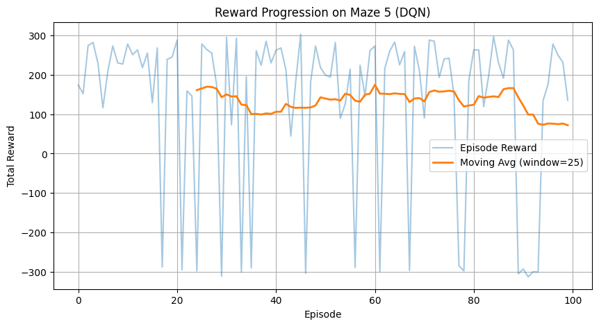
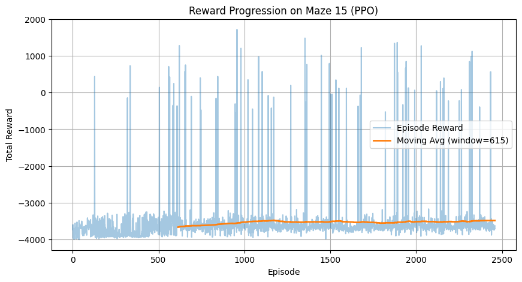
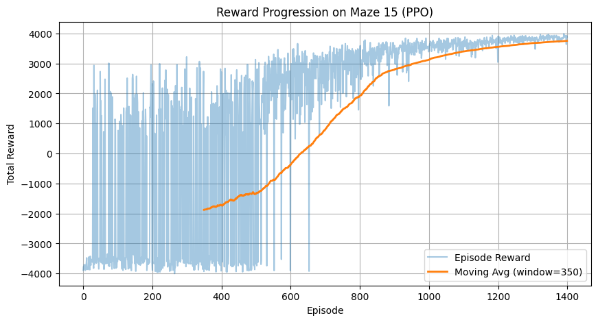

# Maze Reinforcement Learning: Scaling to 15x15

**Custom Environment Design and Reward Engineering for Sparse-Reward Navigation**

[](https://www.python.org/)
[](https://pytorch.org/)
[](https://www.cs.toronto.edu/~vmnih/docs/dqn.pdf)
[](https://arxiv.org/abs/1707.06347)
[](#regular-ppo-the-breakthrough)

---

## The Engineering Challenge: Sparse Rewards at Scale

Maze navigation appears simple—until you scale it. A 5x5 maze has a 50-dimensional state space and yields to standard RL within minutes. A 15x15 maze explodes to 450 dimensions, and suddenly nothing works.

**The core problem:** In a 15x15 maze, the agent must execute 20-40 correct sequential actions to reach the goal. With random exploration, the probability of stumbling onto the goal approaches zero. Standard RL algorithms receive no learning signal—they see only timeout penalties, episode after episode, learning nothing.

```
5x5 Maze                          15x15 Maze
┌───────────┐                     ┌─────────────────────────────────────────────┐
│ # # # # # │                     │ # # # # # # # # # # # # # # #               │
│ # S . . # │                     │ # S . . # . . . # . . . . . #               │
│ # # # . # │                     │ # # # . # . # . # . # # # . #               │
│ # . . . # │                     │ # . . . . . # . . . # . . . #               │
│ # # # G # │                     │ # . # # # # # # # . # . # # #               │
└───────────┘                     │ # . . . . . . . # . # . . . #               │
                                  │ # # # # # . # . # . # # # . #               │
State Space: 50 dims              │ # . . . . . # . # . . . # . #               │
Optimal Path: ~6 steps            │ # . # # # # # . # # # . # . #               │
                                  │ # . # . . . . . . . . . # . #               │
                                  │ # . # . # # # # # # # # # . #               │
                                  │ # . . . # . . . . . . . . . #               │
                                  │ # # # . # . # # # # # . # # #               │
                                  │ # . . . . . # . . . . . . G #               │
                                  │ # # # # # # # # # # # # # # #               │
                                  └─────────────────────────────────────────────┘
                                  State Space: 450 dims
                                  Optimal Path: 30+ steps
```

I built the **Maze Generator**, **Physics Engine**, and **Environment** from scratch. No OpenAI Gym wrappers—direct control over state representation, action mechanics, and reward signals.

---

## Custom Environment & Reward Architecture

### Grid Encoding

The maze uses integer encoding for efficient state representation:

| Value | Symbol | Meaning |
|-------|--------|---------|
| 0 | `.` | Free cell |
| 1 | `#` | Wall |
| 3 | `S` | Start position |
| 4 | `G` | Goal position |

### The 7-Component Reward System

The key insight: **sparse rewards don't work at scale**. I engineered a dense reward signal through seven carefully tuned components:

```python
rewards = [step_cost, timeout_penalty, wall_penalty, goal_reward,
           progress_bonus, wrong_direction_penalty, revisit_penalty]

# 15x15 configuration
rewards = [1, -75, -5, 2750, 0.1, -0.1, -5]
```

| Component | Value | Purpose |
|-----------|-------|---------|
| Step Cost | 1 | Baseline cost per timestep—prevents dawdling |
| Timeout Penalty | -75 | Terminal punishment for exceeding max steps |
| Wall Penalty | -5 | Discourages wall collisions (multiplied with step cost) |
| Goal Reward | 2750 | The sparse signal—reaching the goal |
| Progress Bonus | +0.1 | Reward for reducing Manhattan distance to goal |
| Wrong Direction | -0.1 | Penalty for increasing Manhattan distance |
| **Revisit Penalty** | **-5** | **Triggered when cell visited >3 times** |

### Manhattan Distance Reward Shaping

The progress bonus implements potential-based reward shaping:

$$r_{\text{shaping}}(s, s') = \begin{cases} +\beta & \text{if } d_M(s', g) < d_M(s, g) \\ -\alpha & \text{if } d_M(s', g) > d_M(s, g) \\ 0 & \text{otherwise} \end{cases}$$

Where Manhattan distance is:

$$d_M(s, g) = |x_s - x_g| + |y_s - y_g|$$

### Breaking the Circling Behavior

Early experiments revealed a critical failure mode: **agents learned to circle**. They would oscillate between adjacent cells indefinitely, collecting small step rewards while never progressing toward the goal.

The **Revisit Penalty** solved this:

```python
self.visit_counts[self.agent_pos] += 1
if self.visit_counts[self.agent_pos] > 3:
    reward += self.rewards[6]  # -5 penalty
```

This single mechanism eliminated degenerate oscillating policies. Once a cell is visited more than three times, the cumulative penalty makes circling unprofitable. The agent is forced to explore new territory.

---

## Comparative Analysis: The Path to 15x15

### Baseline DQN: The Plateau



DQN solved the 5x5 maze but hit a hard ceiling. The training curve tells the story: rewards oscillate wildly between -300 and +300, with the moving average stuck around 125. The agent learns *something*, but never achieves consistent performance.

**Why it failed to scale:** DQN's ε-greedy exploration strategy cannot discover sparse rewards in larger state spaces. The probability of a random walk finding the goal in a 15x15 maze is effectively zero. Without ever seeing the goal reward, there's no learning signal to propagate back through the Q-network.

---

### Curriculum PPO: The False Hope



Curriculum learning seemed promising: train on 5x5 first, then 7x7, then progressively larger mazes until reaching 15x15. The theory was that skills would transfer between maze sizes.

**The reality:** The training curve shows complete failure. Rewards stuck at -3500 for over 2500 episodes. Occasional positive spikes appear—moments where the agent stumbled onto the goal—but no sustained learning. The moving average stays flat.

**What went wrong:** The transitions between maze sizes destabilized learning. Skills learned on smaller mazes didn't transfer cleanly. The agent effectively had to relearn navigation at each curriculum stage, and by 15x15, it couldn't bootstrap from the smaller maze experience.

---

### Regular PPO: The Breakthrough



The breakthrough came from trusting the reward engineering instead of algorithmic complexity.

Regular PPO, trained directly on 15x15 mazes with the 7-component reward system, shows textbook convergence. Starting from -4000 (consistent timeouts), the agent steadily improves. By episode 600, positive rewards appear regularly. By episode 1200, the moving average approaches +4000—consistent goal achievement.

**Why it worked:** The dense reward shaping from Manhattan distance progress and the revisit penalty provided continuous learning signal. The agent didn't need curriculum scaffolding because every step gave meaningful feedback about progress toward the goal.

---

## Lessons Learned

### Reward Engineering > Algorithm Complexity

The most important lesson: a well-designed reward function beat curriculum learning. The revisit penalty alone was worth more than any architecture change or training scheme modification.

### Smaller Networks Generalized Better

Counter-intuitively, 16 hidden units outperformed 128. Larger networks overfit to specific maze configurations. Smaller networks learned more transferable navigation primitives.

### From "Lab RL" to Real Environments

Using pre-built gym environments teaches you to call APIs. Building environments from scratch teaches you *why* those APIs exist. Implementing maze physics, state encoding, and reward signals from zero forced a deeper understanding of what RL algorithms actually need.

### DQN vs PPO: When Value-Based Fails

DQN's ε-greedy exploration is fundamentally limited for sparse reward problems. PPO's policy gradient with entropy bonus explored more effectively, finding reward signal where DQN's random exploration couldn't.

---

*This project demonstrates that scaling RL to harder problems often requires engineering the reward signal, not just tuning the algorithm.*
